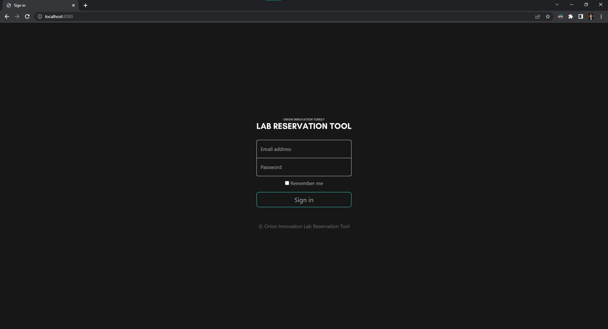
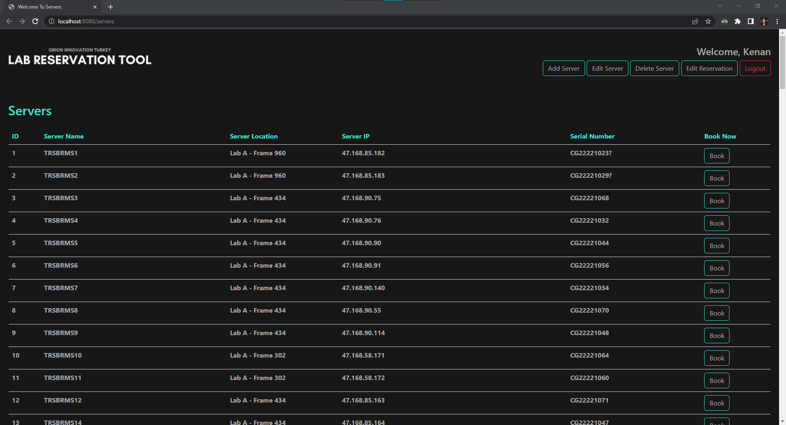
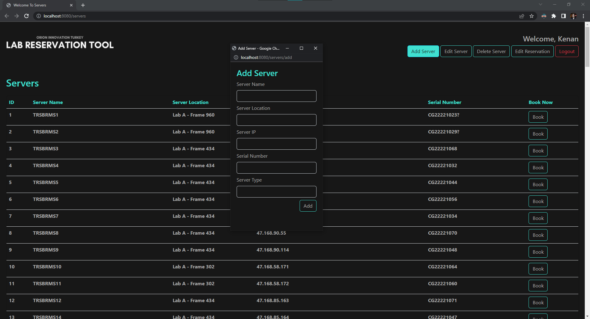
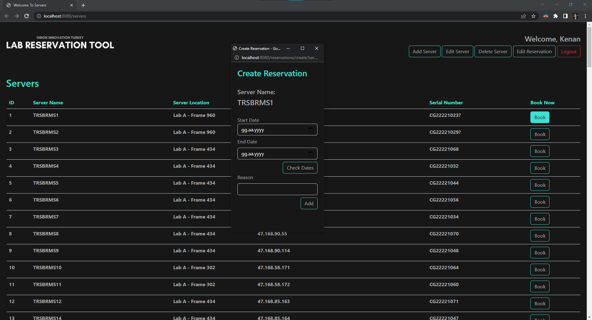
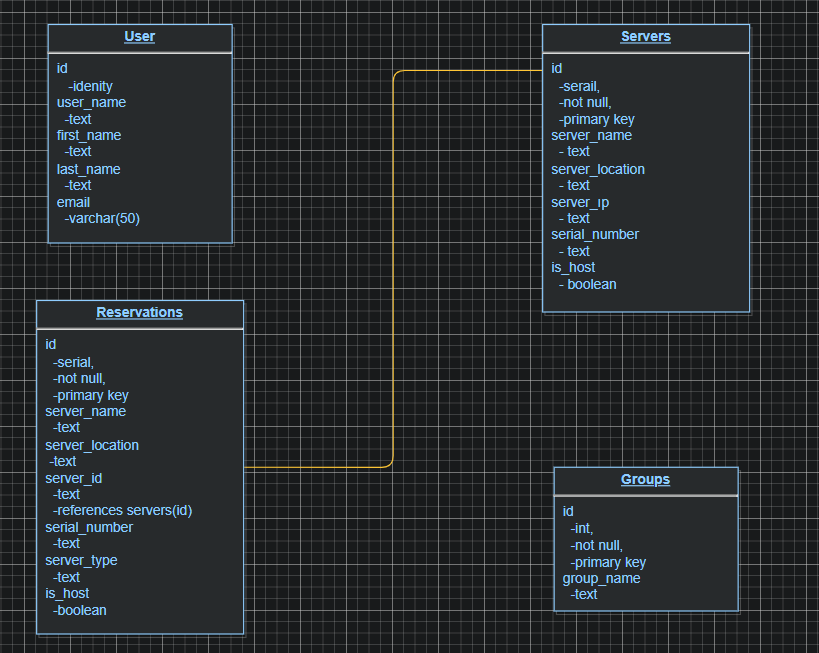
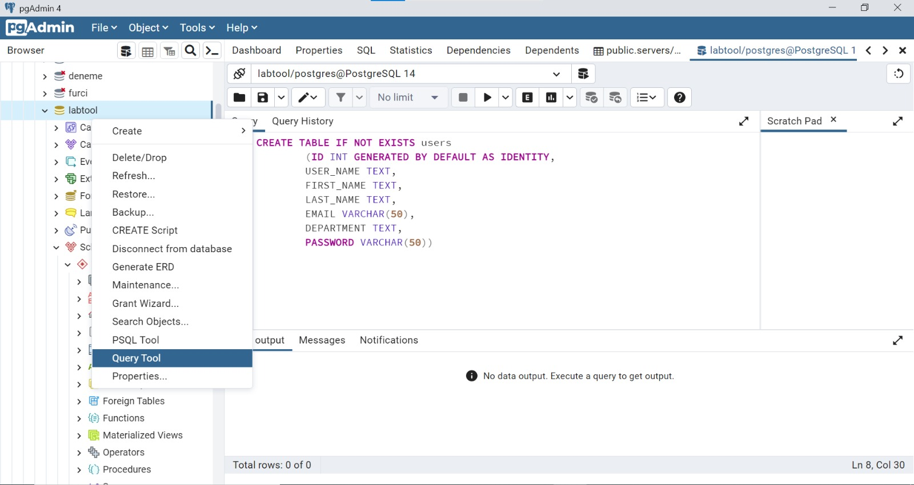

# Lab Reservation Tool

This project is created why we're going to develop a lab reservation app to provide host details and book. Our expectation is that this project eventually will enable a PoC. 

## Tech stack is following
1. Back-end: Java (Spring)
2. Front-end: React
3. Database: PostgreSQL
4. Containerization: Docker

## Details of implementation are below
- Roles: User, super user (admin)

### How Project Looks

	
Screenshots           |  Screenshots 
:-------------------------:|:-------------------------:
  |  
  |  

### Kanban Board ( To Do / In Progress / Done )

To Do:
* User is able to log in.
* User is able to extend reservation.
* Inform the user one week left to deadline

In Progress:
* User is able to book (due date and description are required)
  * User can make reservation but **Check Dates** button is not working yet.

Done:
* User is able to display all server information.
* User can add server.
* There is also uml diagram named uml.drawio in project directory.


### Uml Diagram:



### How To Open Project At First:
1. Install PostgreSQL and install pgAdmin4 
2. Configure Database following informations from ***DBConstants.java*** regarding to your informations like localhost,database name,username and password.
    ```java
    private static final String DB_CONN_URL = "jdbc:postgresql://localhost:5432/your database name";
    private static final String DB_CONN_USERNAME = "your username";
    private static final String DB_CONN_PASSWORD = "your password";
    ```
  3. Create tables manually in Database regarding to ***DBConstants.java***.In pgAdmin4,right click on the database and click "Query Tool".Copy the queries below one by one.
  
```java
      
        CREATE TABLE IF NOT EXISTS users
        (ID INT GENERATED BY DEFAULT AS IDENTITY,
        USER_NAME TEXT,
        FIRST_NAME TEXT,
        LAST_NAME TEXT,
        EMAIL VARCHAR(50),
        DEPARTMENT TEXT,
        PASSWORD VARCHAR(50))

        CREATE TABLE IF NOT EXISTS servers
        (ID SERIAL NOT NULL PRIMARY KEY ,
        SERVER_NAME TEXT,
        SERVER_LOCATION TEXT,
        SERVER_IP TEXT,
        SERIAL_NUMBER TEXT,
        SERVER_TYPE TEXT,
        IS_HOST BOOLEAN)


        CREATE TABLE IF NOT EXISTS reservation
        (ID SERIAL NOT NULL PRIMARY KEY,
        USER_ID INT ,
        SERVER_ID INT REFERENCES servers (ID) ,
        START_DATE DATE,
        END_DATE DATE,
        STATUS BOOLEAN,
        REASON TEXT)

        CREATE TABLE IF NOT EXISTS groups
        (ID INT PRIMARY KEY  NOT NULL,
        GROUP_NAME TEXT)
   ```
   
   4. Import **data.csv** to your database while using pgAdmin4.You can run your query like this,
   ```SQL
        COPY test.servers FROM 'C:\data.csv' DELIMITER ',' CSV HEADER;
    ```
   *Note that,you need to put **data.csv** file in C directory.Otherwise when you try to run your query it will possibly say that permission denied.So **data.csv** need to be in C directory.
   5. After making that preparations, It should work fine. Open project with any code editor like **Visual Studio Code** or **IntelliJ IDEA**.
   6. Install java extensions and Run project.
   7. After running. Paste that link to your browser to go project result: http://localhost:your number/ (in this case,my localhost is 9090.You can change whatever you want.)